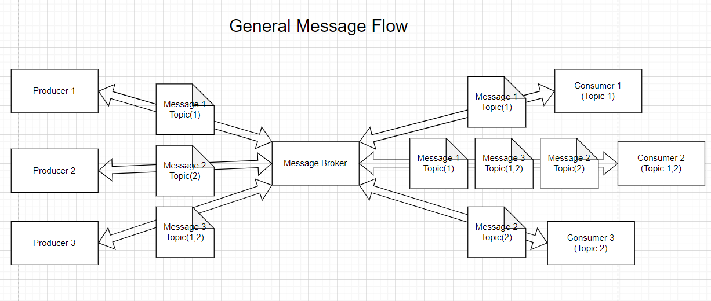
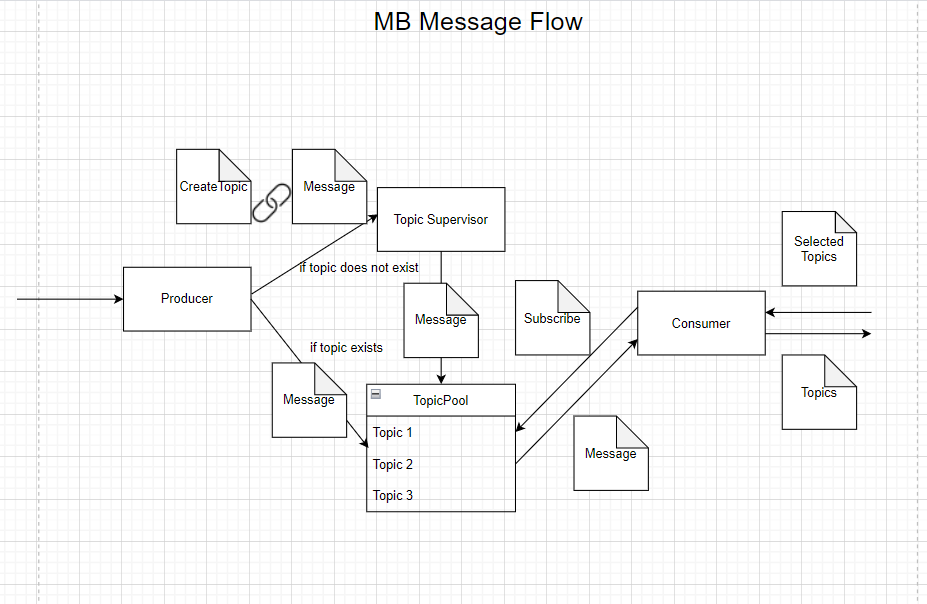
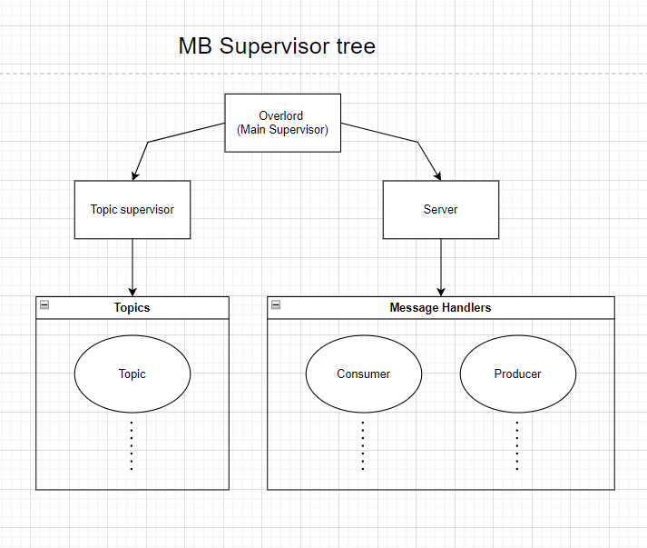

# PTR Lab 3: Message Broker

## Made by: Sorochin Nichita, FAF-191

## Used technologies:

- Scala Language - 2.13.0

- Akka Library - 2.6.18

- Json4s Jackson - 4.1.0M1

## Actors:

1. MainSupervisor - initializes all other actors and supervises them.
2. ListenerSupervisor - initializes both `Listeners` for both streams and supervises them.
3. Listener - listens for the SSE stream from corresponding endpoint of Producer Server
4. SenderSupervisor - initializes `Senders` and supervises them.
5. SenderManager - first actor to interact with client (consumers), after communicates with `SenderSupervisor` (or `SenderScaler`) to create senders for connection, delegates subscriptions and much more.
6. SenderScaler - W.I.P. of its concept, maybe will be completely useless in the future.

## Diagrams:

### General Message Flow

### Message Broker Message Flow

### Supervisor Tree

