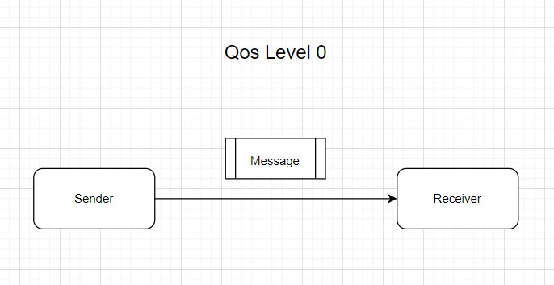
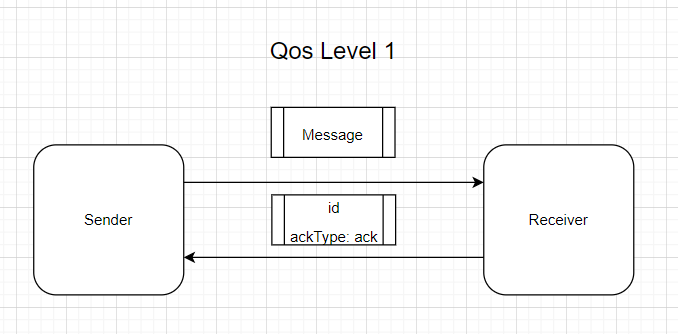
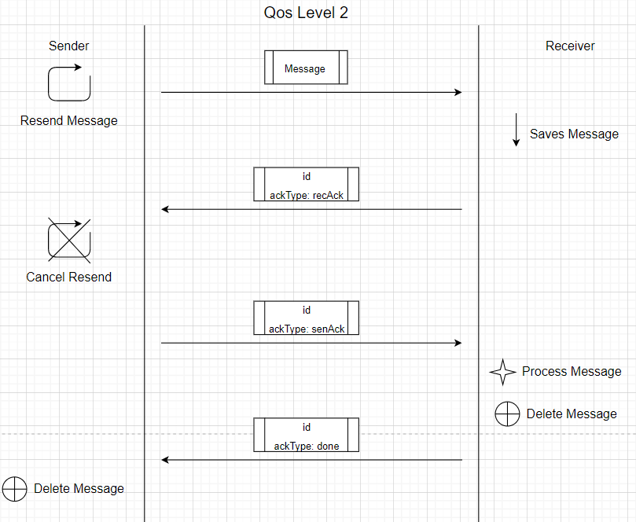

# Real Time Programming: Message Broker

## Made by: Sorochin Nichita

### Navigation

- [Description](#description)
- [Main Components](#main-components)
  - [Message Broker](#message-broker)
  - [Consumer](#consumer)
  - [Producer](#producer)
  - [RTP-Server](#rtp-server)
- [Quality of Service (QoS)](#quality-of-service-qos)
- [User Technologies](#used-technologies)

# Description

Unbelievable Message Broker written using Scala Language + Akka Library.

It can receive TCP connections from both `Producers` and `Consumers`.
`Producers` sends data, which mandatory contains topic for every message, and 
then all the messages will be split by the `Topic` criteria.
`Consumers` receives list of topics, and chooses which topic it wants to be subscribed to. 
Afterwards, it successfully will start receiving corresponding messages.

Quantity of `Consumers` and `Producers` may vary and are limited only by Akka TCP 
possibilities. `Consumers` and `Producers` can be developed as you wish 
and using language you wish, the only point it has to create TCP connection and follow
several rules that are mentioned below.

> Note: You can dockerize all three projects, just by firstly running `runDocker.sh` in every project. Pulling docker image of mongodb 
(docker pull mongo) and rtp server (mentionet below) and then running `runCompose.sh` you can compose and run all the images together and then run whole project
with one producer and one consumer.

All the diagrams and documents are located in folder `docs`.

For all the Apps, you can find configuration in `/src/resources/application.conf`. 
There you can configure network addresses for Apps (like `hostname`, `messagebroker` and address of mongodb server.
For every value default is `localhost`).

> Another Note: If you are not similar to Scala, make sure that you have installed needed tools for that. If you are using IntelliJ check [this link](https://www.jetbrains.com/help/idea/discover-intellij-idea-for-scala.html#scala_plugin).

# Main Components

- ## Message Broker

The main component, which is described above. 

Located in the folder `messageBroker`.

- ## Consumer

Recommended small app also developer using Scala Language + Akka Library. Connects to
the Message Broker, subscribes and receives messages from it and prints them. Pretty
easy, huh?

Located in the folder `consumer`.

Of course, you can create your own `Consumer`. How it can connect to the Message Broker:
### 1. Open TCP Connection with Message Broker (Port by default is `8000`)
### 2. Send next JSON:
```json
{
  "connectionType": "Consumer",
  "QoS": 0
}
```
> Note: QoS stands for "Quality of Service" like MQTT does have, which can receive values from 0 to 2. 
More about QoS you can read [here](https://www.hivemq.com/blog/mqtt-essentials-part-6-mqtt-quality-of-service-levels/).

### 3. After, `Consumer` receives list of available topics. It can choose, all, some or none of them.
> Note: If `Consumer` will include topic that do not exist in Message Broker actual list, it
this topic will be ignored.

To send selected topics back, just send the next JSON:
```json
{
  "topics" : 
  [
    "en",
    "es"
  ]
}
```

Instead of `"en", "es"` put your own list of topics.

### 4.  Profit! Your consumer now receives messages.

```scala
object MessagesHandler {

  case class Acknowledgement(id: Int)

}
```

- ## Producer

Recommended app developed using (guess what?) Scala Language + Akka Library. Connects to
the Message Broker and to the Docker Image `rtp-server`, which is described below.

Located in the folder `producer`.

Of course, you can create your own `Producer`. How it can connect to the Message Broker:
### 1. Open TCP Connection with Message Broker (Port by default is `8000`)
### 2. Send next JSON:
```json
{
  "connectionType": "Producer",
  "QoS": 0
}
```

### 3. Profit! Your producer now can send messages in next JSON pattern:
```json
{
  "id": 12,
  "topic": "en",
  "message": "this is a message"
}
```

- ## RTP-server

The Docker Image courtesy provided by our beloved FAFer Alex Burlacu. Actually 
is a server providing SSE Stream with Tweeter tweets in JSON format. It can be pulled by 
using command:
```shell
docker pull alexburlacu/rtp-server:faf18x
```
To run the Docker Image, you can use next line:
```shell
docker run -p 4000:4000 alexburlacu/rtp-server:faf18x
```
# Quality of Service (QoS)

Similar to MQTT, this Message Broker has QoS Technology.

### QoS Level 0

For this QoS Level consumer don't have to make any kind of Acknowledgement. Just receive it and that's all.



### QoS Level 1

For this QoS Level Receiver just has to send back Acknowledgement message with `id` of the received message and `ackType`,
with value `ack`. If Message Broker is a Sender and has not received Acknowledgement message, it resends original message every 100 milliseconds.
If there were last 100 message resends without Acknowledgement, the connection will be closed by the Message Broker.



### QoS Level 2

For this QoS Level Sender sends original message to the Receiver, and waits for the Acknowledgement message from the Sender
with corresponding `id` and `ackType` with value `recAck`. If such Acknowledgement was not received, Sernder resends original message.
If Sender has received Acknowledgement from Receiver, it stops resending original message and sends to the Receiver another Acknowledgement
message with the same `id` and `ackType` with value `senAck`. When Receiver gets such message, it processes the original message, and sends to
Sender Acknowledgement message with (guess what?) same `id` and `ackType` with value `done`. Afterwards, Sender can easily resend this message again.



# Used Technologies 

- ### Scala Language - 2.13.0

- ### Akka Library - 2.6.18

- ### Alpakka SSE - 3.0.4

- ### Akka Persistance - 2.6.18

- ### Akka Persistance Mongo Scala - 3.0.8

- ### Json4s Jackson - 4.1.0M1
