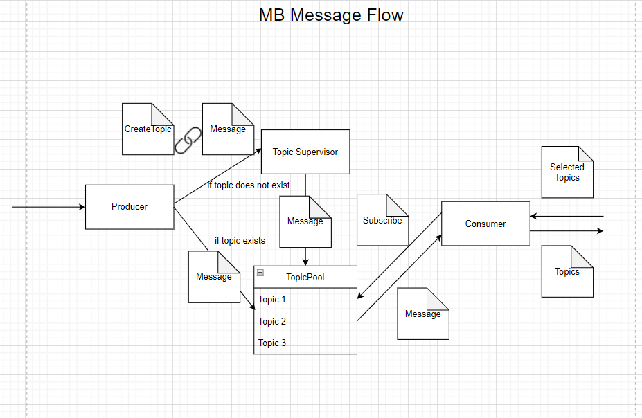
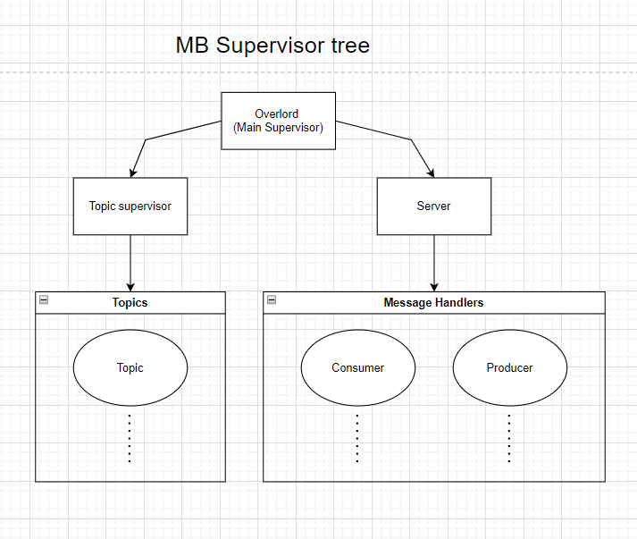
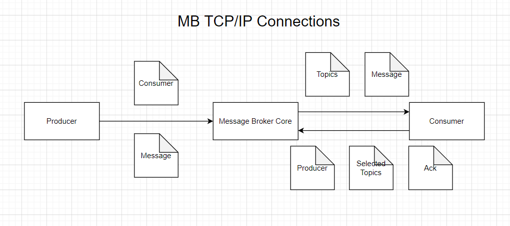

# PTR Lab 3: Message Broker

## Made by: Sorochin Nichita, FAF-191

## Used technologies:

- Scala Language - 2.13.0

- Akka Library - 2.6.18

- Alpakka SSE - 3.0.4

- Akka Persistance - 2.6.18

- Akka Persistance Mongo Scala - 3.0.8

- Json4s Jackson - 4.1.0M1

## Actors:

## 1. MainSupervisor (Overlord) - initializes all other actors and supervises them.
### Receives
- `CreateServer`
- `CreateTopicSupervisor`

## 2. Server - initializes both `Consumers` and `Producers` with corresponding TCP-connections.
### Receives
- `Bound` if the Server actor was bound to the given hostname and port.
- `Connected`, when someone tries to connect to the MessageBroker by TCP.
- `CommandFailed`, when the command is being failed to process.

## Message Hanlder - is actor which can perform two behaviors:

## 3. Producer - receives messages from the corresponding TCP-connection (producer type).
### Receives
- `Received` with data from the TCP-connection
### Sends
- `Message` message to the corresponding `Topic Actor` if exists, otherwise to the `TopicSupervisor`, which then will create corresponding `Topic Actor`

## 4. Consumer - sends and receives data from the corresponding TCP-connection (consumer type)
### Receives
- `Message` from the `Topic Actor` which he subscribed to.
- `Acknowledgement` with corresponding Message id from the TCP-connection.
### Sends
- `Message` to the TCP-connection.
- `Subscribe` to the `Topic Actor` which he wants to be subscribed to.
- `Unsubscribe` to the `Topic Actor` to cancel subscription to it, usually unsubscribes when the connection being closed.

## 5. Topic Actor - saves all subscribers and sends corresponding topic messages to consumers if they are subscribed to it.
### Sends
- `Message` message to `Consumer` with topic and text
### Receives
- `Message` from `Producer` with topic and text
- `Subscribe` (to topic) from `Sender`
- `Unsubscribe` from `Sender`

## 6. TopicSupervisor - initializes `Topic Actor`s and supervises it.
### Sends
- `Message` to `Topic Actor` after its initilization or just sends if it was already initialized.
### Receives
- `CreateTopic` message from the Producer to create corresponding Topic and send it first message.

## Diagrams:

### General Message Flow

### Message Broker Message Flow

### Supervisor Tree

### TCP/IP Connections

